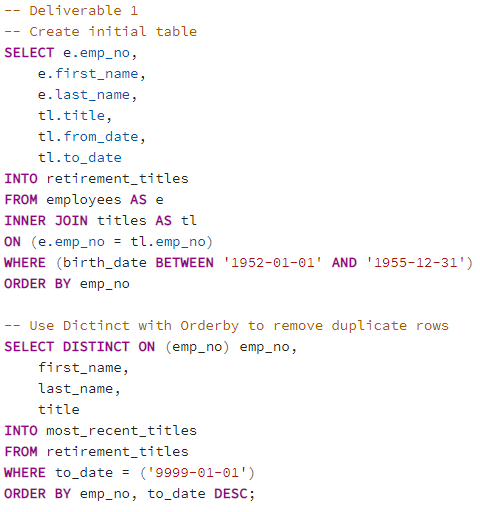

# Pewlett-Hackard-Analysis

## Overview of the Analysis
The purpose of this analysis was to examine the current employee profiles of all employees at Pewlett Hackard. This was done in order understand the demographics of retirement ready or soon-to-be retirement ready employees. This analysis will help the company to prepare to ensure that they have a highly qualified workforce through this wave of retirements.

## Results
- The first table that was created was filtered for employees of retirement age and the title that they had. However, it was not taken into account that employees may have had multiple job titles at their time at Pewlett Hackard. Retirement age employees have had 133,777 roles throughout their time at Pewlett Hackard. In the next bullet point, the table was filtered using "DISTINCT ON" to get only the current title of retirement age employees. Below is the code for both this bullet point and the next one to showcase the difference. 

  

- Pewlett Hackard has 72,459 employees that were born beteween 1952 and 1955. This population represents employees that would be eligible for retirement in the near future and, thus, the population that Pewlett Hackard is interested in creating a replacement plan for (unique_titles.csv).

- The vast majority of the employees who are up for retirement in the near future have the job title of Senior Manager or Senior Staff. You can see the full breakdown of retirement-age employees by job title below (retiring_titles.csv).

  

- In order to prepare for "the silver tsunami", Pewlett Hackard is interested in starting a mentorship program of employees that have solide experience and, with mentorship, could replace those who are retiring. Pewlett Hackard has a pool of 1,550 employees to utilize as mentees in the mentorship program (mentorship_eligibility.csv).

## Summary
- Roles to Fill: There are 72,459 employess who will be retiring soon. The exact list of retirees can be referenced in the unique_titles.csv.

- Mentorship Program: There is an overabundance of mentors available for the mentorship program and not enough mentees. When filtering for employees who were born in 1965 and eligible to be a mentee, only 1,550 were recovered. This is a large discrepency from the 72,459 employees who are retiring. The two tables below were created to furth breakdown mentor / mentee opportunities. There are discrepencies across all job titles. 
  - Mentor Availability:

  

  - Mentee Availability: 

  

The code to create the second table was similar to that of the first table in deliverable 1. The only difference is that mentorship_eligibility table is where the data is being pulled from. 

